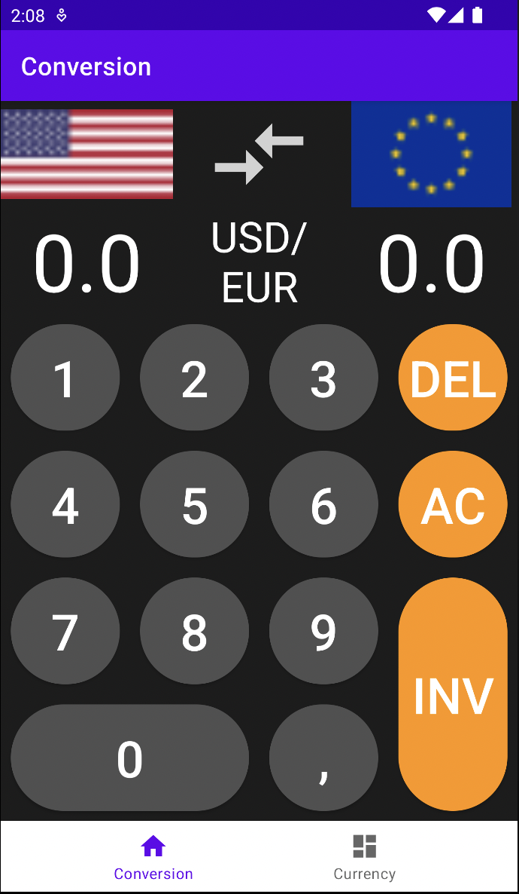
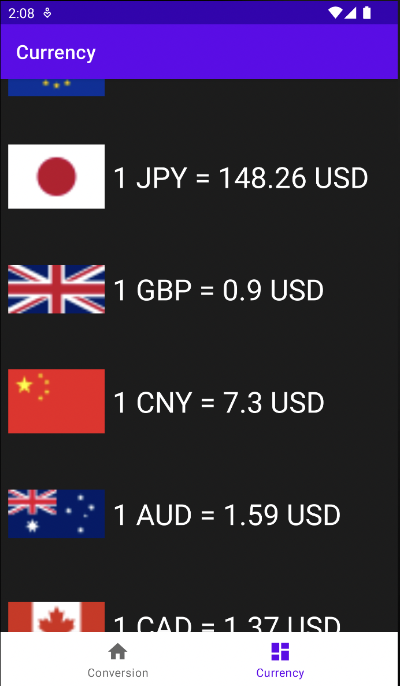

# Currency Converter

This repository contains the source code for a simple currency converter app built using Android Studio. It was made for a school project.

  
  

## Features

- Convert between various currencies
- Easy-to-use and intuitive interface

## Getting Started

These instructions will get you a copy of the project up and running on your local machine for development and testing purposes.

### Prerequisites

- Android Studio (latest version recommended)

### Installation

1. Clone the repository:

‘‘‘shell
git clone https://github.com/yourusername/CurrencyConverter.git
‘‘‘

2. Open the project in Android Studio.
3. Sync the project with Gradle by clicking the "Sync Now" button or running the following command in the terminal:

‘‘‘shell
/gradlew build
‘‘‘

4. Run the app on an emulator or a connected Android device.

## Built With

- [Android Studio](https://developer.android.com/studio) - The official IDE for Android development

## License

This project is licensed under the MIT License.
